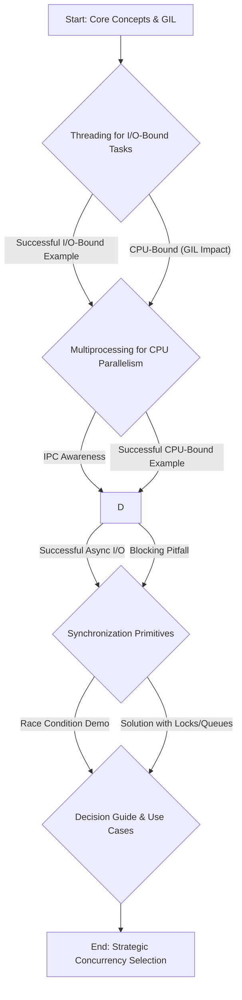

# Python Concurrency Sandbox

This repository is a curated collection of small, self-contained Python scripts designed to provide a foundational understanding of concurrency in Python. It covers `threading`, `multiprocessing`, `asyncio`, and synchronization primitives, emphasizing practical usage, common pitfalls, and the unique challenges posed by the Global Interpreter Lock (GIL). The project aims to build intuition for *when* to use each tool, *why* it behaves the way it does, and *how* to debug the subtle, non-deterministic issues that often arise.

## Learning Journey Overview

The learning path in this sandbox follows a structured "theory -> practical demonstration (including pitfalls) -> solution" cycle for each major concurrency concept. This approach aims to build intuition for *when* to use each tool, *why* it behaves the way it does, and *how* to debug the subtle, non-deterministic issues that often arise.



## Concepts Covered

*   **Core Concepts:** Concurrency vs. Parallelism, Processes, Threads, Asynchronous Programming.
*   **Global Interpreter Lock (GIL):** Its nature and impact on Python's threading.
*   **`threading` Module:** Creating and managing threads, suited for I/O-bound tasks.
*   **`multiprocessing` Module:** Bypassing the GIL for CPU-bound tasks, Inter-Process Communication (IPC).
*   **`asyncio` Library:** Coroutines, `async`/`await`, event loops for asynchronous I/O.
*   **Synchronization Primitives:** Locks, Semaphores, Queues to prevent race conditions and manage shared resources.
*   **Use Cases:** When to choose each concurrency approach.

## How to Run

1.  **Clone the repository:**
    ```bash
    git clone https://github.com/aastom/python-concurrency-sandbox.git
    cd python-concurrency-sandbox
    ```
2.  **Create and activate a virtual environment (recommended):**
    ```bash
    python3 -m venv venv
    source venv/bin/activate  # On Windows, use `venv\Scripts\activate`
    ```
3.  **Install dependencies:**
    Some examples may require external libraries (e.g., `aiohttp` for async HTTP requests).
    ```bash
    pip install -r requirements.txt
    ```
4.  **Navigate to an example directory and run the script:**
    Each directory (`01_core_concepts/`, `02_threading/`, etc.) contains `.py` files. Refer to the specific `README.md` within each directory (or `definitions.md` for `01_core_concepts`) for details on each example.
    ```bash
    cd 02_threading/
    python3 io_bound_web_fetch.py
    ```
    Always check the individual file's comments or associated markdown for expected output and learning objectives.

## References

*   [Python `threading` documentation](https://docs.python.org/3/library/threading.html)
*   [Python `multiprocessing` documentation](https://docs.python.org/3/library/multiprocessing.html)
*   [Python `asyncio` documentation](https://docs.python.org/3/library/asyncio.html)
*   [Real Python: An Intro to Threading in Python](https://realpython.com/intro-to-python-threading/)
*   [Real Python: Speed Up Your Python Programs with Concurrency](https://realpython.com/python-concurrency/)
*   [David Beazley: Generators, Coroutines, Concurrency](https://www.dabeaz.com/coroutines/Coroutines.pdf) (Advanced, but excellent for `asyncio` fundamentals)

## 📚 Documentation

All formal documentation for the Python Concurrency Sandbox project is published to Google Drive, offering rich formatting and easy access:

*   **Drive Folder:** [Python Concurrency Sandbox — R&D Lab](https://drive.google.com/drive/folders/1gFLYp4tAYo9MpbF1eX4eDCVWeLJ0nIGl)
*   **Main Documentation Bundle:** [Python Concurrency Sandbox - Documentation Bundle](https://docs.google.com/document/d/1lu3nYrE7u9Zu5f8UyZWYFRV2eBHFAknMJ4hChzTaE0Q/edit?usp=drivesdk)

Within the Drive folder, you will find a detailed Learning Roadmap and PDF copies of key reference materials.