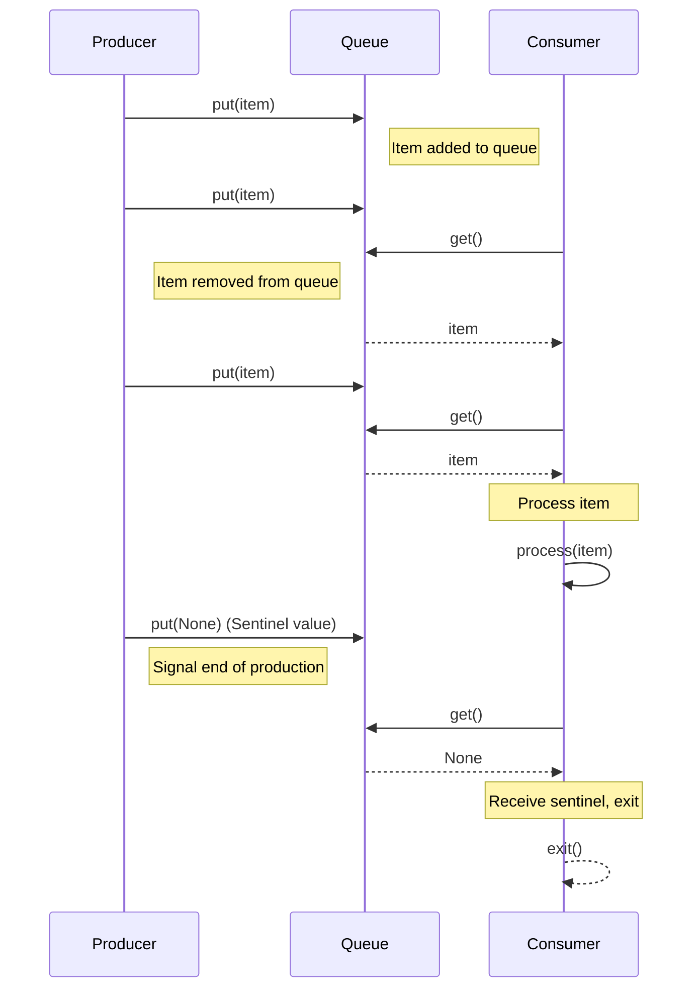

# Architecture and Design Principles

This project is structured as a collection of isolated, runnable examples, each designed to demonstrate a specific concept or pitfall in Python concurrency. The architecture prioritizes clarity, simplicity, and direct observation over building a complex application.

## Core Principles

*   **Modularity:** Each example resides in its own file or small set of files, making it easy to understand and run independently.
*   **Illustrative Focus:** Examples are crafted to clearly show *how* a concurrency mechanism works, *when* it's beneficial, and *what* common problems (like the GIL, blocking calls, race conditions) it might introduce or solve.
*   **Minimal Dependencies:** We primarily leverage Python's standard library. External libraries are only introduced when absolutely necessary to demonstrate a realistic scenario (e.g., `aiohttp` for `asyncio` web requests).
*   **Reproducibility:** While concurrency can be non-deterministic, the *demonstration of the concept* (e.g., a race condition happening, a speedup observed) is designed to be reliably reproducible.

## Example: Producer-Consumer with a Queue (Conceptual Sequence)

Many concurrency problems, especially those involving data exchange between concurrent units, can be modeled with a producer-consumer pattern. This diagram illustrates the flow using a shared queue, a fundamental synchronization primitive.

## Project Structure Rationale

The project is organized into numbered directories corresponding to the learning path. This linear progression helps build understanding incrementally:

*   `01_core_concepts/`: Introduces fundamental definitions and the GIL.
*   `02_threading/`: Focuses on Python threads, their utility for I/O, and the GIL's impact on CPU tasks.
*   `03_multiprocessing/`: Demonstrates true parallelism for CPU-bound tasks and inter-process communication.
*   `04_asyncio/`: Explores cooperative multitasking for highly concurrent I/O operations.
*   `05_synchronization/`: Teaches how to prevent race conditions using primitives like locks, semaphores, and queues.
*   `06_decision_guide/`: Provides consolidated advice on choosing the right concurrency tool.

Each directory typically contains:
*   Markdown files for conceptual explanations and example details.
*   Python scripts (`.py`) for runnable demonstrations.

This structure ensures that each topic is well-contextualized and easily accessible for hands-on learning.
